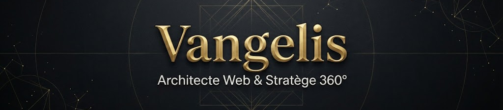

  

 

> **Fort de plus de 15 ans d'expérience en gestion de projet et relation client, je conçois et développe des solutions web innovantes qui transforment vos idées en succès concrets.**

---

### 🚀 Ma Double Compétence : Tech & Stratégie

Je ne me contente pas d'écrire du code. Je construis des solutions robustes en m'appuyant sur une solide expérience terrain.

| **🎨 Technique & Conception** | **🤝 Gestion & Humain** |
| :--- | :--- |
| **Optimisation & Performance** Analyse, debugging et recherche de solutions pragmatiques pour des applications rapides. | **Expérience Client & Commerciale** 15+ ans à cultiver un sens aigu de la relation client et du déploiement de projets d'envergure. |
| **Sécurité & Accessibilité** Application des bonnes pratiques pour la sécurisation des données (Auth, RLS) et l'accessibilité web. | **Pilotage & Coordination** Capacité à piloter des affaires complexes, optimiser les plannings et coordonner les équipes (Agile). |
| **Pont Technique/Stratégie** Traduction des besoins clients en spécifications fonctionnelles claires. | **Communication** Vulgarisation des concepts techniques pour aligner les parties prenantes. |

---

### 🛠️ Arsenal Technique

J'utilise une stack moderne pour créer des interfaces performantes et maintenables.

**Front-End & UI**

**Back-End & Data**

**Outils & Qualité**

---

### 🌟 Projet Phare

**[🎲 Meeple & Milestones](https://github.com/Vangelis-26/meeple-milestones)**
Une application "Premium" de suivi de challenges ludiques.
* **Stack :** React, Supabase, Tailwind, Recharts.
* **Architecture :** Authentification sécurisée, Temps réel, UX Mobile-First.
* **Challenge :** Intégration API BoardGameGeek et gestion de données complexes.

---

  
  
    

  
  

